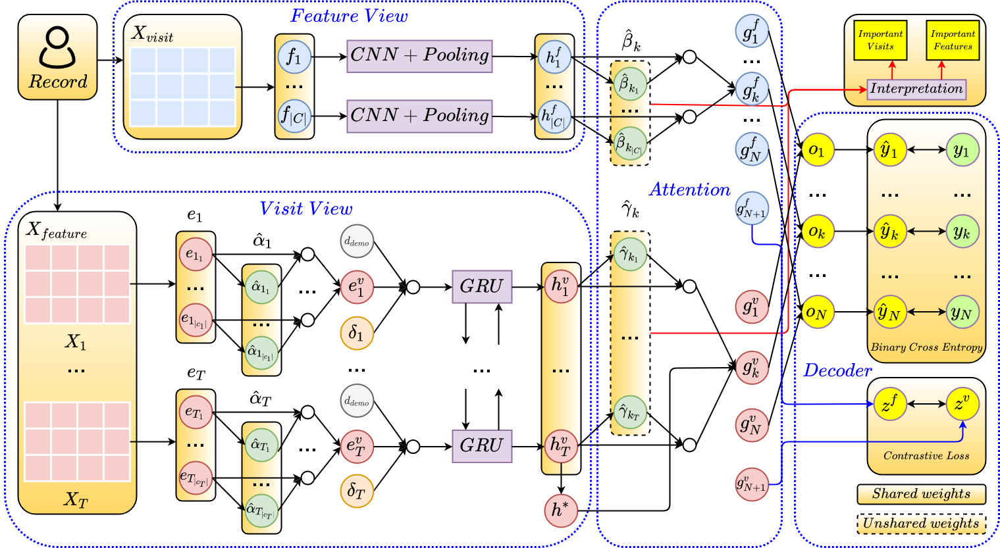

ICDM 2021 submission's code

# MuViTaNet - A Multi-View Multi-Task Network for Complication Risk Profiling
-----------------------------------------------------------------

## 1. Introduction
This repository contains source code (**MuViTaNet**) for paper "Cardiac Complication Risk Profiling for Cancer Survivors via Multi-View Multi-Task Learning" (**ICDM 2021**).

**MuViTaNet** is a Python implementation of the multi-view multi-task network for predicting the onset of multiple 
complications. In particular, **MuViTaNet** complements patient representation by using a multi-view encoder to effectively 
extract information by considering clinical data as both sequences of clinical visits and sets of clinical features. 
In addition, it leverages additional information from both related labeled and unlabeled datasets to generate more 
generalized representations by using a new multi-task learning scheme for making more accurate predictions.

The experimental results show that **MuViTaNet** outperforms existing methods for profiling the development of 
cardiac complications in breast cancer survivors. Furthermore, thanks to its multi-view multi-task architecture, 
**MuViTaNet** also provides an effective mechanism for interpreting its predictions in multiple perspectives, thereby 
helping clinicians discover the underlying mechanism triggering the onset and for making better clinical treatments in 
real-world scenarios.

## 3. MuViTaNet



Figure 1: Overall architecture of **MuViTaNet**

## 4. Installation

**MuViTaNet** depends on Numpy, tqdm, scikit-learn, and PyTorch (CUDA toolkit if use GPU). 
You must have them installed before using **MuViTaNet**.

The simple way to install them is using conda:

```sh
	$ conda install numpy tqdm scikit-learn pytorch
```
## 5. Usage

### 5.1. Data

We do not provide the insurance claim data itself due to copyright issue.

### 5.2. Training MuViTaNet

The training script for **MuViTaNet** is located at the main folder.

```sh
    $ python muvitanet_main.py 
```

Arguments in this scripts:

* ``--fold``:       data fold in cross-validation setting
* ``--batch_size``:         batch size used for training
* ``--max_epoch``:        maximum number of training iterations
* ``--model_name``:        name of model
* ``--gpu``:      gpu id
* ``--warm_start``: train model from pretrained weights
* ``--inference``:       use model in inference stage
